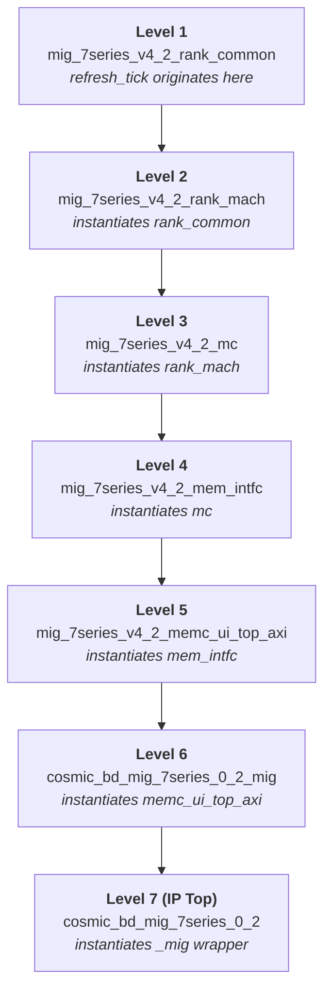

# `ext_refresh_tick` Instantiation Path Trace

## Signal Origin: `refresh_tick` in [rank_common.v](file:///c:/_CAMSIN/cosmic_ray_detection/cosmic_ray_detection.gen/sources_1/bd/cosmic_bd/ip/cosmic_bd_mig_7series_0_2/cosmic_bd_mig_7series_0_2/user_design/rtl/controller/mig_7series_v4_2_rank_common.v)

The `refresh_tick` signal is **generated** inside `mig_7series_v4_2_rank_common` and is currently hardwired to `1'b0` (refresh disabled):

```verilog
// rank_common.v, lines 138-159
wire refresh_tick_lcl;         // computed by internal refresh_timer logic
...
output wire refresh_tick;
//  assign refresh_tick = refresh_tick_lcl;   // ← original (auto-refresh ~7.8 µs)
    assign refresh_tick = 1'b0;               // ← current (refresh disabled)
```

To implement controllable refresh, this becomes:

```verilog
input ext_refresh_tick;                       // NEW external input
assign refresh_tick = ext_refresh_tick;        // driven by FSM
```

---

## Full Instantiation Hierarchy (bottom → top)

The port must be threaded up through **6 levels** of hierarchy. At each level you add `ext_refresh_tick` as an input port and pass it down.



---

## Detailed File-by-File Path

### Level 1 — [rank_common.v](file:///c:/_CAMSIN/cosmic_ray_detection/cosmic_ray_detection.gen/sources_1/bd/cosmic_bd/ip/cosmic_bd_mig_7series_0_2/cosmic_bd_mig_7series_0_2/user_design/rtl/controller/mig_7series_v4_2_rank_common.v) (signal origin)

| | |
|---|---|
| **File** | [mig_7series_v4_2_rank_common.v](file:///c:/_CAMSIN/cosmic_ray_detection/cosmic_ray_detection.gen/sources_1/bd/cosmic_bd/ip/cosmic_bd_mig_7series_0_2/cosmic_bd_mig_7series_0_2/user_design/rtl/controller/mig_7series_v4_2_rank_common.v) |
| **Module** | `mig_7series_v4_2_rank_common` |
| **Key lines** | [L138–159](file:///c:/_CAMSIN/cosmic_ray_detection/cosmic_ray_detection.gen/sources_1/bd/cosmic_bd/ip/cosmic_bd_mig_7series_0_2/cosmic_bd_mig_7series_0_2/user_design/rtl/controller/mig_7series_v4_2_rank_common.v#L138-L159) — `refresh_tick` output, currently `= 1'b0` |
| **Change** | Add `input ext_refresh_tick` port, change assignment to `assign refresh_tick = ext_refresh_tick;` |

---

### Level 2 — [rank_mach.v](file:///c:/_CAMSIN/cosmic_ray_detection/cosmic_ray_detection.gen/sources_1/bd/cosmic_bd/ip/cosmic_bd_mig_7series_0_2/cosmic_bd_mig_7series_0_2/user_design/rtl/controller/mig_7series_v4_2_rank_mach.v) (instantiates `rank_common`)

| | |
|---|---|
| **File** | [mig_7series_v4_2_rank_mach.v](file:///c:/_CAMSIN/cosmic_ray_detection/cosmic_ray_detection.gen/sources_1/bd/cosmic_bd/ip/cosmic_bd_mig_7series_0_2/cosmic_bd_mig_7series_0_2/user_design/rtl/controller/mig_7series_v4_2_rank_mach.v) |
| **Module** | `mig_7series_v4_2_rank_mach` |
| **Instantiation** | [L212](file:///c:/_CAMSIN/cosmic_ray_detection/cosmic_ray_detection.gen/sources_1/bd/cosmic_bd/ip/cosmic_bd_mig_7series_0_2/cosmic_bd_mig_7series_0_2/user_design/rtl/controller/mig_7series_v4_2_rank_mach.v#L212) — `rank_common0` instance |
| **`refresh_tick` wiring** | [L139](file:///c:/_CAMSIN/cosmic_ray_detection/cosmic_ray_detection.gen/sources_1/bd/cosmic_bd/ip/cosmic_bd_mig_7series_0_2/cosmic_bd_mig_7series_0_2/user_design/rtl/controller/mig_7series_v4_2_rank_mach.v#L139) — declared as internal `wire refresh_tick;` |
| | [L200](file:///c:/_CAMSIN/cosmic_ray_detection/cosmic_ray_detection.gen/sources_1/bd/cosmic_bd/ip/cosmic_bd_mig_7series_0_2/cosmic_bd_mig_7series_0_2/user_design/rtl/controller/mig_7series_v4_2_rank_mach.v#L200) — consumed by `rank_cntrl0` `.refresh_tick(refresh_tick)` |
| | [L230](file:///c:/_CAMSIN/cosmic_ray_detection/cosmic_ray_detection.gen/sources_1/bd/cosmic_bd/ip/cosmic_bd_mig_7series_0_2/cosmic_bd_mig_7series_0_2/user_design/rtl/controller/mig_7series_v4_2_rank_mach.v#L230) — produced by `rank_common0` `.refresh_tick(refresh_tick)` |
| **Change** | Add `input ext_refresh_tick` port, pass to `rank_common0` as `.ext_refresh_tick(ext_refresh_tick)` |

> [!IMPORTANT]
> `refresh_tick` stays internal to `rank_mach` — it's produced by `rank_common` (line 230) and consumed by the `rank_cntrl` instances (line 200). Only the new `ext_refresh_tick` input needs to be added as a port.

---

### Level 3 — [mc.v](file:///c:/_CAMSIN/cosmic_ray_detection/cosmic_ray_detection.gen/sources_1/bd/cosmic_bd/ip/cosmic_bd_mig_7series_0_2/cosmic_bd_mig_7series_0_2/user_design/rtl/controller/mig_7series_v4_2_mc.v) (instantiates `rank_mach`)

| | |
|---|---|
| **File** | [mig_7series_v4_2_mc.v](file:///c:/_CAMSIN/cosmic_ray_detection/cosmic_ray_detection.gen/sources_1/bd/cosmic_bd/ip/cosmic_bd_mig_7series_0_2/cosmic_bd_mig_7series_0_2/user_design/rtl/controller/mig_7series_v4_2_mc.v) |
| **Module** | `mig_7series_v4_2_mc` |
| **Instantiation** | [L560](file:///c:/_CAMSIN/cosmic_ray_detection/cosmic_ray_detection.gen/sources_1/bd/cosmic_bd/ip/cosmic_bd_mig_7series_0_2/cosmic_bd_mig_7series_0_2/user_design/rtl/controller/mig_7series_v4_2_mc.v#L560) — `rank_mach0` instance |
| **Change** | Add `input ext_refresh_tick` port, pass to `rank_mach0` as `.ext_refresh_tick(ext_refresh_tick)` |

---

### Level 4 — [mem_intfc.v](file:///c:/_CAMSIN/cosmic_ray_detection/cosmic_ray_detection.gen/sources_1/bd/cosmic_bd/ip/cosmic_bd_mig_7series_0_2/cosmic_bd_mig_7series_0_2/user_design/rtl/ip_top/mig_7series_v4_2_mem_intfc.v) (instantiates `mc`)

| | |
|---|---|
| **File** | [mig_7series_v4_2_mem_intfc.v](file:///c:/_CAMSIN/cosmic_ray_detection/cosmic_ray_detection.gen/sources_1/bd/cosmic_bd/ip/cosmic_bd_mig_7series_0_2/cosmic_bd_mig_7series_0_2/user_design/rtl/ip_top/mig_7series_v4_2_mem_intfc.v) |
| **Module** | `mig_7series_v4_2_mem_intfc` |
| **Instantiation** | [L528](file:///c:/_CAMSIN/cosmic_ray_detection/cosmic_ray_detection.gen/sources_1/bd/cosmic_bd/ip/cosmic_bd_mig_7series_0_2/cosmic_bd_mig_7series_0_2/user_design/rtl/ip_top/mig_7series_v4_2_mem_intfc.v#L528) — `mc0` instance |
| **Change** | Add `input ext_refresh_tick` port, pass to `mc0` as `.ext_refresh_tick(ext_refresh_tick)` |

---

### Level 5 — [memc_ui_top_axi.v](file:///c:/_CAMSIN/cosmic_ray_detection/cosmic_ray_detection.gen/sources_1/bd/cosmic_bd/ip/cosmic_bd_mig_7series_0_2/cosmic_bd_mig_7series_0_2/user_design/rtl/ip_top/mig_7series_v4_2_memc_ui_top_axi.v) (instantiates `mem_intfc`)

| | |
|---|---|
| **File** | [mig_7series_v4_2_memc_ui_top_axi.v](file:///c:/_CAMSIN/cosmic_ray_detection/cosmic_ray_detection.gen/sources_1/bd/cosmic_bd/ip/cosmic_bd_mig_7series_0_2/cosmic_bd_mig_7series_0_2/user_design/rtl/ip_top/mig_7series_v4_2_memc_ui_top_axi.v) |
| **Module** | `mig_7series_v4_2_memc_ui_top_axi` |
| **Instantiation** | [L570](file:///c:/_CAMSIN/cosmic_ray_detection/cosmic_ray_detection.gen/sources_1/bd/cosmic_bd/ip/cosmic_bd_mig_7series_0_2/cosmic_bd_mig_7series_0_2/user_design/rtl/ip_top/mig_7series_v4_2_memc_ui_top_axi.v#L570) — `mem_intfc0` instance |
| **Change** | Add `input ext_refresh_tick` port, pass to `mem_intfc0` as `.ext_refresh_tick(ext_refresh_tick)` |

---

### Level 6 — [_mig.v](file:///c:/_CAMSIN/cosmic_ray_detection/cosmic_ray_detection.gen/sources_1/bd/cosmic_bd/ip/cosmic_bd_mig_7series_0_2/cosmic_bd_mig_7series_0_2/user_design/rtl/cosmic_bd_mig_7series_0_2_mig.v) (instantiates `memc_ui_top_axi`)

| | |
|---|---|
| **File** | [cosmic_bd_mig_7series_0_2_mig.v](file:///c:/_CAMSIN/cosmic_ray_detection/cosmic_ray_detection.gen/sources_1/bd/cosmic_bd/ip/cosmic_bd_mig_7series_0_2/cosmic_bd_mig_7series_0_2/user_design/rtl/cosmic_bd_mig_7series_0_2_mig.v) |
| **Module** | `cosmic_bd_mig_7series_0_2_mig` |
| **Instantiation** | [L999](file:///c:/_CAMSIN/cosmic_ray_detection/cosmic_ray_detection.gen/sources_1/bd/cosmic_bd/ip/cosmic_bd_mig_7series_0_2/cosmic_bd_mig_7series_0_2/user_design/rtl/cosmic_bd_mig_7series_0_2_mig.v#L999) — `u_memc_ui_top_axi` instance |
| **Change** | Add `input ext_refresh_tick` port, pass to `u_memc_ui_top_axi` as `.ext_refresh_tick(ext_refresh_tick)` |

---

### Level 7 — [cosmic_bd_mig_7series_0_2.v](file:///c:/_CAMSIN/cosmic_ray_detection/cosmic_ray_detection.gen/sources_1/bd/cosmic_bd/ip/cosmic_bd_mig_7series_0_2/cosmic_bd_mig_7series_0_2/user_design/rtl/cosmic_bd_mig_7series_0_2.v) (IP top-level wrapper)

| | |
|---|---|
| **File** | [cosmic_bd_mig_7series_0_2.v](file:///c:/_CAMSIN/cosmic_ray_detection/cosmic_ray_detection.gen/sources_1/bd/cosmic_bd/ip/cosmic_bd_mig_7series_0_2/cosmic_bd_mig_7series_0_2/user_design/rtl/cosmic_bd_mig_7series_0_2.v) |
| **Module** | `cosmic_bd_mig_7series_0_2` |
| **Instantiation** | [L157](file:///c:/_CAMSIN/cosmic_ray_detection/cosmic_ray_detection.gen/sources_1/bd/cosmic_bd/ip/cosmic_bd_mig_7series_0_2/cosmic_bd_mig_7series_0_2/user_design/rtl/cosmic_bd_mig_7series_0_2.v#L157) — `u_cosmic_bd_mig_7series_0_2_mig` instance |
| **Change** | Add `input ext_refresh_tick` to module port list (line 153), pass to child as `.ext_refresh_tick(ext_refresh_tick)` |

---

## Summary: Files Requiring Edits

| # | File | Change |
|---|------|--------|
| 1 | [mig_7series_v4_2_rank_common.v](file:///c:/_CAMSIN/cosmic_ray_detection/cosmic_ray_detection.gen/sources_1/bd/cosmic_bd/ip/cosmic_bd_mig_7series_0_2/cosmic_bd_mig_7series_0_2/user_design/rtl/controller/mig_7series_v4_2_rank_common.v) | Add `input ext_refresh_tick`, change `refresh_tick` assignment |
| 2 | [mig_7series_v4_2_rank_mach.v](file:///c:/_CAMSIN/cosmic_ray_detection/cosmic_ray_detection.gen/sources_1/bd/cosmic_bd/ip/cosmic_bd_mig_7series_0_2/cosmic_bd_mig_7series_0_2/user_design/rtl/controller/mig_7series_v4_2_rank_mach.v) | Add `input ext_refresh_tick`, wire to `rank_common0` |
| 3 | [mig_7series_v4_2_mc.v](file:///c:/_CAMSIN/cosmic_ray_detection/cosmic_ray_detection.gen/sources_1/bd/cosmic_bd/ip/cosmic_bd_mig_7series_0_2/cosmic_bd_mig_7series_0_2/user_design/rtl/controller/mig_7series_v4_2_mc.v) | Add `input ext_refresh_tick`, wire to `rank_mach0` |
| 4 | [mig_7series_v4_2_mem_intfc.v](file:///c:/_CAMSIN/cosmic_ray_detection/cosmic_ray_detection.gen/sources_1/bd/cosmic_bd/ip/cosmic_bd_mig_7series_0_2/cosmic_bd_mig_7series_0_2/user_design/rtl/ip_top/mig_7series_v4_2_mem_intfc.v) | Add `input ext_refresh_tick`, wire to `mc0` |
| 5 | [mig_7series_v4_2_memc_ui_top_axi.v](file:///c:/_CAMSIN/cosmic_ray_detection/cosmic_ray_detection.gen/sources_1/bd/cosmic_bd/ip/cosmic_bd_mig_7series_0_2/cosmic_bd_mig_7series_0_2/user_design/rtl/ip_top/mig_7series_v4_2_memc_ui_top_axi.v) | Add `input ext_refresh_tick`, wire to `mem_intfc0` |
| 6 | [cosmic_bd_mig_7series_0_2_mig.v](file:///c:/_CAMSIN/cosmic_ray_detection/cosmic_ray_detection.gen/sources_1/bd/cosmic_bd/ip/cosmic_bd_mig_7series_0_2/cosmic_bd_mig_7series_0_2/user_design/rtl/cosmic_bd_mig_7series_0_2_mig.v) | Add `input ext_refresh_tick`, wire to `u_memc_ui_top_axi` |
| 7 | [cosmic_bd_mig_7series_0_2.v](file:///c:/_CAMSIN/cosmic_ray_detection/cosmic_ray_detection.gen/sources_1/bd/cosmic_bd/ip/cosmic_bd_mig_7series_0_2/cosmic_bd_mig_7series_0_2/user_design/rtl/cosmic_bd_mig_7series_0_2.v) | Add `input ext_refresh_tick`, wire to `u_cosmic_bd_mig_7series_0_2_mig` |

Above this IP top-level, the signal enters the block design and needs to be wired through `cosmic_bd_wrapper.v` → `cosmic_top.v` → `detector_fsm.v` (which generates the tick).
